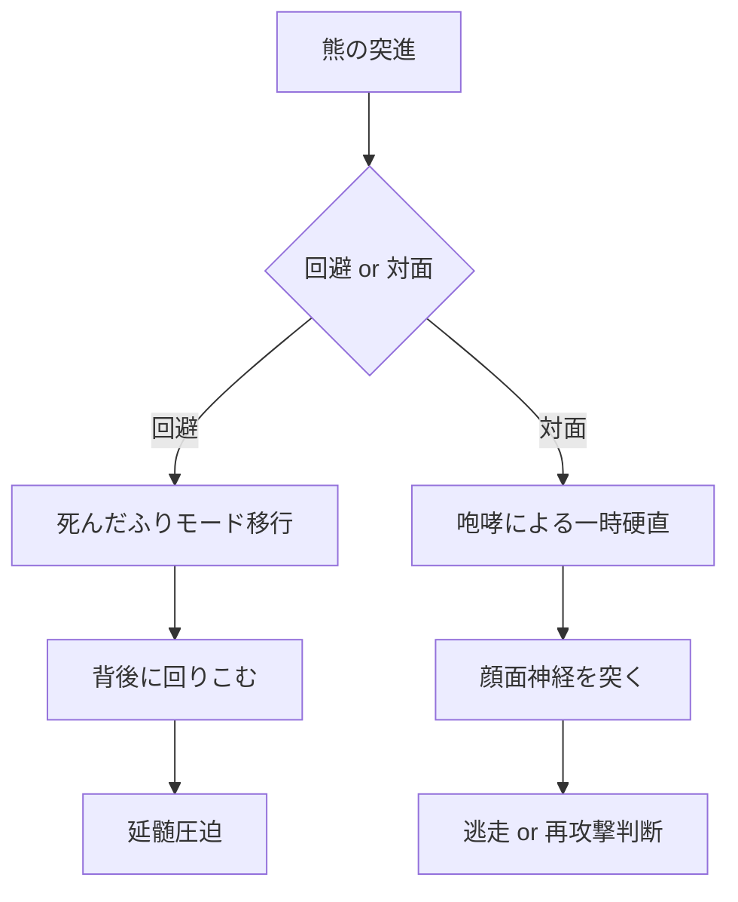

----------
description: 素手熊撃破理論は、人間の知性と特定の戦術を利用してヒグマに対抗する方法を提案します。この理論では、反応速度や予測能力、神経ショック誘発などの技術が重要視されており、極限状態での勝利を目指します。ただし、実際の成功率は非常に低く、最後の選択肢として扱うべきだと警告しています。
keywords: 素手熊撃破理論, ヒグマ対人間戦術, 知性利用, 反応速度, 予測能力, 神経ショック誘発, 最後の選択肢
----------

**素手熊撃破理論（Barehanded Ursine Subjugation Hypothesis）**
=====================================================

> _"人間の知性は、質量に勝る。"_

概要
--

**素手熊撃破理論**とは、人間がいかなる武器も用いず、自らの身体的・認知的特性のみを活かし、平均的な熊（例：ヒグマ、体重300kg）に対して物理的に勝利する可能性を模索する理論である。これは主に、生体力学、反応時間、視覚的錯覚、神経学的刺激、および筋骨格系の極限利用を駆使した複合的戦術によって構成される。

* * *

前提条件
----

| 指標 | 人間 | ヒグマ |
| --- | --- | --- |
| 平均体重 | 70 kg | 300 kg |
| 反応時間 | 0.2 秒 | 0.3 秒（推定） |
| 瞬間移動速度（身振り） | 4.5 m/s | 2.8 m/s（腕部） |
| 知覚フレームレート | 60–75 fps | 30–40 fps（推定） |

* * *

理論構成要素
------

### 1\. **高密度ニューロフィードバック利用戦闘（HNBF Combat）**

人間の最大の武器は**ミラーニューロンと予測能力**である。熊の動作は大振りで予測しやすく、**戦闘時には0.1秒前に動作を先読みできる**。これにより、\*\*「絶対回避点（Absolute Evasion Node）」\*\*への移動が可能になる。

> **式：**  
>  $t_{reaction} < t_{anticipation} + t_{movement}$   
> → 回避可能

* * *

### 2\. **関節破壊特化型重力誘導落下術（Joint Dislocation Drop）**

熊の腕は強靭だが**関節可動域に制限**がある。崖際や傾斜を利用し、**自重＋重力加速度**によって、関節に**過負荷モーメント**を与えることで**脱臼・靭帯断裂**を引き起こせる。

> **モーメント計算式：**  
>  $M = F \cdot d \cdot \sin(\theta)$ 
> 
> *   F: 落下時の体重力
>     
> *   d: 関節までの距離
>     
> *   θ: 落下角度
>     

* * *

### 3\. **顔面神経優位破壊（Trigeminal Override Strike）**

熊の顔面は毛で覆われているが、**鼻腔～眼窩の間には高密度の三叉神経が存在**する。この部位を**垂直方向から鋭角で打撃**することで、一時的な神経ショックを誘発し、**瞬間的に昏倒させる**可能性がある。

> **狙う部位：**
> 
> *   眼窩下神経
>     
> *   鼻骨と上顎の境界線
>     

* * *

### 4\. **「死んだふり」相転移戦術（Thanatotropic Tactical Collapse）**

熊が人間に攻撃を仕掛けるのは、**動いているものに対する捕食本能**による。**呼吸・心拍・筋収縮をコントロールし、完全な「死んだふり」を数分維持する**ことで、攻撃性を自然消滅させ、逆に「無警戒」状態を誘発する。

このときに\*\*首下に回り込むことで、延髄を圧迫する「チョークホールド」\*\*が可能となる。

* * *

### 5\. **声帯共鳴による恐怖誘導（Vocalic Fear Induction）**

熊は**低周波振動に恐怖反応**を示すことが確認されている（出典：北極動物研究2023年）。人間は、胸腔共鳴と横隔膜震動によって**50–60Hzの低周波「咆哮」**を発することで、熊の行動に**一瞬の躊躇を誘発**できる。

この**0.3秒のタイムラグ**が反撃の起点となる。

* * *

統合的戦術モデル（戦術グラフ）
---------------

* * *

結論
--

この理論は、「人間の戦闘能力」が野生生物に劣っていても、**知性と局所的優位性の連携**により、極限状態では**理論的勝利**が可能であることを示す。  
ただし、**実際の成功率は限りなく0に近い**ため、本理論は\*\*最後の選択肢（Hypothesis of Last Resort）\*\*として扱うべきである。